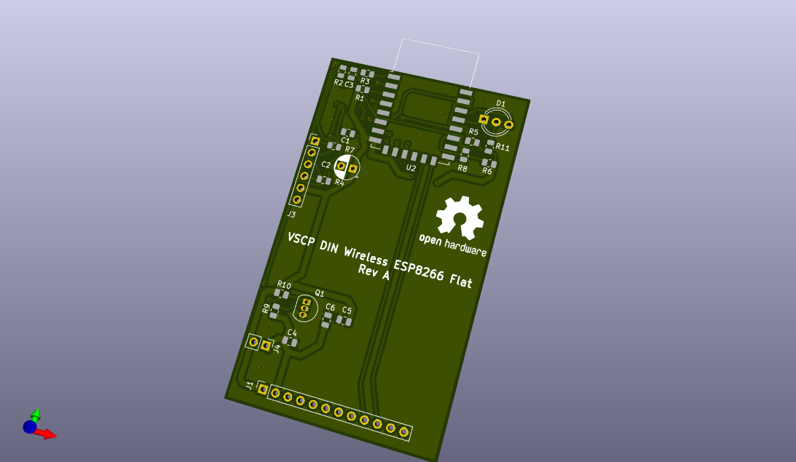
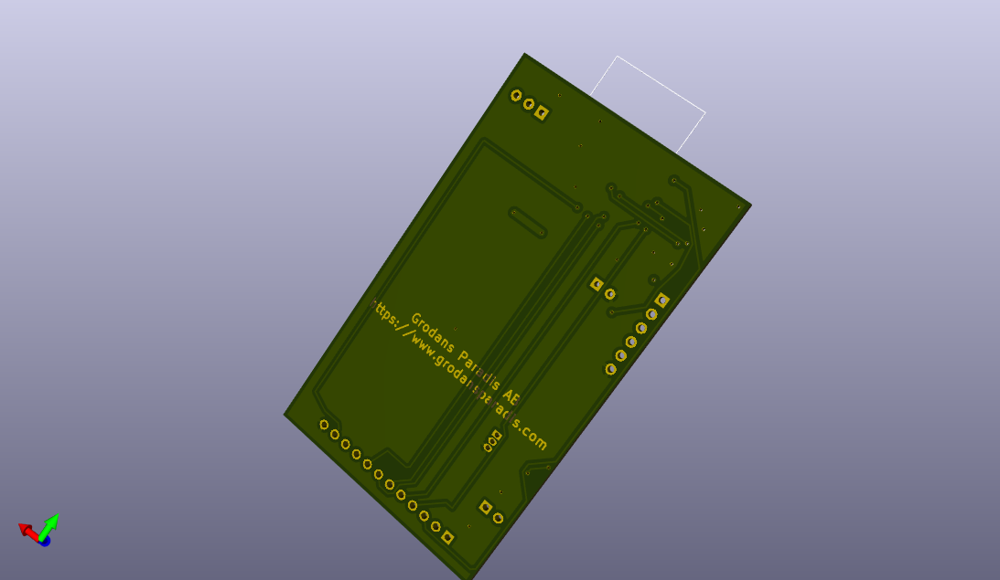

# vscp-din-wireless-esp8266-flat
ESP8266 based VSCP controller in flat DIN package. The usage for the modul is to interface a P1 electricity meter and report meter readings over VSCP.

Can be powered from the meter or externally.

**Note!** This is still a prototype.

## PCB's

 

---

Part of the [VSCP Project](https://www.vscp.org).

Copyright 2021-2022 © Åke Hedman, (Grodans Paradis AB)[https://www.grodansparadis.com]
